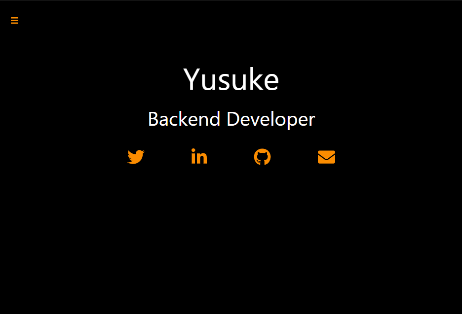

# portfolio
This is my portfolio site.



# Live project 
https://portfolio-yk-jp.vercel.app/

# Usage

## Clone repository
 run this command to clone this repository
 ```
 git clone https://github.com/yk-jp/portfolio.git
 ``` 

## Install Dependencies
Run following commands in the frontend folder
```
npm install 
```

## Setup for environment variables
Create an ```.env``` file in the frontend folder. <br>
your private data in ```.env``` file are as follows. 
```
TWITTER = ""
LINKEDIN = ""
GITHUB = ""
EMAIL = ""
```

## Start app
Run following commands and open http://localhost:3000 in your browser.
```
npm run dev
```

# Tech stack 
*  HTML
*  CSS
*  Materialize
*  styled-components 
*  React
*  Typescript
*  webpack
*  Babel